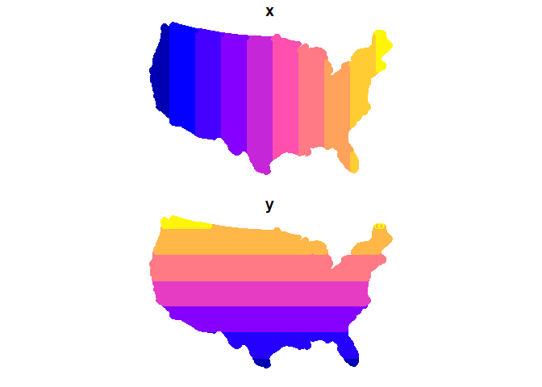
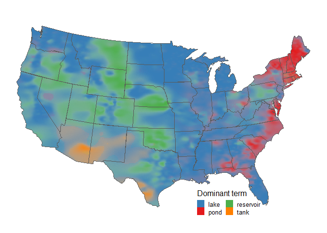
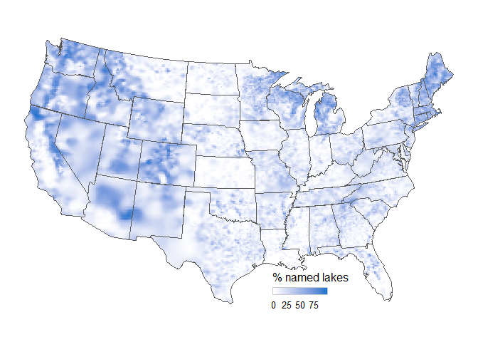
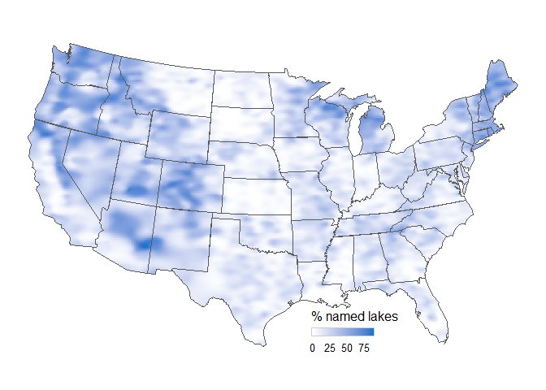

Lake Name Spatial Interpolation
================
Nicole Smith
2020-02-07

Introduction
============

Map figures are re-used by the author from: Soranno, P.A., Webster, K.E., Smith, N.J., Díaz Vázquez, J. and Cheruvelil, K.S. (2020), What Is in a “Lake” Name? That Which We Call a Lake by Any Other Name. Limnology and Oceanography Bulletin. [doi:10.1002/lob.10355](https://doi.org/10.1002/lob.10355).

This document shows the code used to create the heat map figures in the above publication.

Inspiration for the mapping technique came from Joshua Katz's viral [United States dialect heat maps](https://web.archive.org/web/20170104133211/http://www4.ncsu.edu/~jakatz2/files/dialectposter.png) summarizing Bert [Vaux's dialect survey results](https://www4.uwm.edu/FLL/linguistics/dialect/maps.html). (If you want to take the [original NYTimes quiz](https://www.nytimes.com/interactive/2014/upshot/dialect-quiz-map.html) with all dialect items, you must log in to NYTimes.) I was looking for a way to implement the k-nearest neighbors with Gaussian kernel technique in R when I found a really helpful blog demonstrating the use of the `kknn` package by [Timo Grossenbacher](https://timogrossenbacher.ch/2018/03/categorical-spatial-interpolation-with-r/). The interpolations ran in under 2 minutes each on my faily powerful desktop workstation, so I did not need to parallelize the **kknn** operation in the way he describes.

Imports and pre-processing
==========================

We'll use the `kknn` package for the k-nearest neighbors analysis because it presents the label probability along with the label itself and also permits several kernel choices, including Gaussian weighting. We'll use `ggplot` for the maps, `sf` for the geo data handling, and a couple of the `tidyverse` packages for data wrangling.

``` r
if (!require('kknn')) install.packages('kknn'); library('kknn')
if (!require('ggplot2')) install.packages('ggplot2'); library('ggplot2')
if (!require('sf')) install.packages('sf'); library('sf')
if (!require('dplyr')) install.packages('dplyr'); library('dplyr')
if (!require('purrr')) install.packages('purrr'); library('purrr')
```

Import the lake names data. We'll the LAGOS-US lake population, derived from the permanent lakes and reservoirs over 1 hectare in the National Hydrography Dataset.

``` r
# load my dataset.
# gdb <-  'C:/Users/smithn78/Dropbox/CL_HUB_GEO/Nicole_Assorted_R/Lake_Name_Viz/kernel_map.gdb'
# lakes_sf <- read_sf(gdb, 'lakes_all') %>%
#   st_zm(drop=TRUE) %>%
#   dplyr::select(name = lake_namegnis, lagoslakeid)
# save(lakes_sf, file='lakes_sf.RData')
load('lakes_sf.RData')
```

Prepare the lakes data to be used for the training datsets. We need the location (x, y) as well as a label (here, "type" or "named") for every observation.

``` r
# to start, need a table with columns x, y, name type at a minimum.
classed_lakes_sf <- lakes_sf %>%
  mutate(x=st_coordinates(.)[,1],
         y=st_coordinates(.)[,2],
         type = as.factor(case_when(
    name == ' ' ~ 'noname',
    grepl('lake', name, ignore.case=TRUE) ~ 'lake',
    grepl('pond', name, ignore.case=TRUE) ~ 'pond',
    grepl('reservoir', name, ignore.case=TRUE) ~ 'reservoir',
    grepl('tank', name, ignore.case=TRUE) ~ 'tank',
    # tried all these below but did not choose to put them in the final map, small signals
    #grepl('slough', name, ignore.case=TRUE) ~ 'slough',
    #grepl('spring', name, ignore.case=TRUE) ~ 'spring',
    #grepl('lac', name, ignore.case=TRUE) ~ 'lac',
    #grepl('bog', name, ignore.case=TRUE) ~ 'bog',
    #grepl('meadow', name, ignore.case=TRUE) ~ 'meadow',
    #grepl('deadwater', name, ignore.case=TRUE) ~ 'deadwater',
    #grepl('flowage', name, ignore.case=TRUE) ~ 'flowage',
    TRUE ~ 'other'))
  ) %>%
  mutate(named = as.factor(if_else(type == 'noname', 'noname', 'name'))) %>%
  dplyr::select(x, y, type, named) %>%
  st_set_geometry(NULL)
```

Import the states for mapping. We use our own states layer made for LAGOS-US here, and simplified the state boundaries a bit for nice maps. We'll make a slightly buffered polygon of the contiguous U.S. to use to define the prediction grid. we will also make a little buffer around the U.S. to use to make the rasterized edges look neater in the final map.

``` r
# states for mapping
# states <- read_sf(gdb, 'states') %>%
#   st_set_crs(5070) %>%
#   st_simplify(preserveTopology=TRUE, dTolerance=3000) %>%
#   mutate(abbrev = state.abb[match(state_name, state.name)])
# save(states, file='states.RData')
load('states.RData')

states_merge <- states %>%
  st_union() %>%
  st_simplify(preserveTopology=TRUE, dTolerance=3000)

# prediction grid needs to extend a bit beyond the state borders
states_buff <- states_merge %>%
  st_buffer(10000)

# for visualization effect only: raster pixels at the size I use look untidy along U.S. edges on the map,
# so I cover them up with a white buffer poly
buff_viz <- states_merge %>%
  st_buffer(30000) %>%
  st_sym_difference(states_merge)
```

kNN
===

Create a prediction grid for k-nearest neighbors. This is a point object that we will visualize with ggplot::geom\_raster() later. The k-value will determine how local vs. glocal the predicted patterns appear, but the cell size will also determine how that translates to the visual effect of the map. I used artistic license in the selection of both--I want a map in which the color blending would be interpretable, that blurs over some of the very local quirks in naming, and that doesn't look chunky or pixelated.

``` r
# make gridded points spanning U.S., clip to U.S. Use buffer so our raster map doesn't come up short at borders.
cell_size = 15000 # at my discretion, played with this and the k-value until I liked the result
us_grid <- st_make_grid(states_buff, cellsize=cell_size, what="centers") %>%
  st_sf() %>%
  mutate(x = st_coordinates(.)[,1],
         y = st_coordinates(.)[,2]) %>%
  st_intersection(states_buff) %>%
  dplyr::select(x, y)
```

    ## Warning: attribute variables are assumed to be spatially constant
    ## throughout all geometries

``` r
plot(us_grid)
```



Use k-nearest neighbors to generated the name-type interpolation map. Only lakes with names will be used for training.

``` r
# set k by testing the local vs. global look of different values; this is a viz not a statistical test
k = 149

# 'other' didn't make enough visible difference for name-type map, so we will drop it.
named_lakes_only <- classed_lakes_sf %>%
  filter(type != 'noname' & type != 'other') %>% 
  mutate(type = droplevels(type)) %>%
  select(-named)

# knn: seems like it can't ignore extra columns
nametype_labels <- kknn(type ~ .,
                   train=named_lakes_only,
                   test=us_grid,
                   kernel='gaussian',
                   k=k)
```

We'll add the nametype\_labels and probabilities to the us\_grid object and do some math that prepares for the blended colors in the visualization. The alpha transparency value will control the blending. I'm sure there must be a more elegant way to interpolate between the main color values, but this did the job. The colors will blend between the top two label choices and their corresponding color. The remaining label choices can "muddy" the color if they were likely; we will grey down the color to indicate the muddle. The grey will ensure the alpha values add up to 100% so the map has even color intensity.

``` r
# I used this blend factor value to help get the alpha values looking the way I liked
blend = .7

# add labels to sf object AND
# alpha viz math
nametype_mappable <- us_grid %>%
  mutate(type1 = fitted(nametype_labels),
         type2 = as.factor(unlist(purrr::map(apply(nametype_labels$prob, 1, function(x) names(which(x == max(x[x!=max(x)])))),1))),
         type1.prob = apply(nametype_labels$prob, 1, function(x) max(x)),
         type2.prob = apply(nametype_labels$prob, 1, function(x) max(x[x!=max(x)])),
         type3.prob = 1-type1.prob-type2.prob,
         alpha1 = type1.prob + (1- blend) * type2.prob,
         alpha2 = blend * type2.prob,
         alpha3 = type3.prob,
         alphasum = alpha1 + alpha2 + alpha3,
         probsum = type1.prob + type2.prob + type3.prob
         )

head(nametype_mappable)
```

    ## Simple feature collection with 6 features and 12 fields
    ## geometry type:  POINT
    ## dimension:      XY
    ## bbox:           xmin: -168535.2 ymin: 308672.9 xmax: -123535.2 ymax: 323672.9
    ## epsg (SRID):    5070
    ## proj4string:    +proj=aea +lat_1=29.5 +lat_2=45.5 +lat_0=23 +lon_0=-96 +x_0=0 +y_0=0 +ellps=GRS80 +towgs84=0,0,0,0,0,0,0 +units=m +no_defs
    ##           x        y                   geometry type1     type2 type1.prob
    ## 1 -153535.2 308672.9 POINT (-153535.2 308672.9)  lake reservoir  0.5222577
    ## 2 -138535.2 308672.9 POINT (-138535.2 308672.9)  lake reservoir  0.5223032
    ## 3 -168535.2 323672.9 POINT (-168535.2 323672.9)  lake reservoir  0.5234429
    ## 4 -153535.2 323672.9 POINT (-153535.2 323672.9)  lake reservoir  0.5228157
    ## 5 -138535.2 323672.9 POINT (-138535.2 323672.9)  lake reservoir  0.5232860
    ## 6 -123535.2 323672.9 POINT (-123535.2 323672.9)  lake reservoir  0.5233906
    ##   type2.prob type3.prob    alpha1    alpha2    alpha3 alphasum probsum
    ## 1  0.3536620  0.1240802 0.6283563 0.2475634 0.1240802        1       1
    ## 2  0.3549766  0.1227201 0.6287962 0.2484836 0.1227201        1       1
    ## 3  0.3520636  0.1244936 0.6290619 0.2464445 0.1244936        1       1
    ## 4  0.3528656  0.1243187 0.6286754 0.2470059 0.1243187        1       1
    ## 5  0.3546191  0.1220949 0.6296717 0.2482334 0.1220949        1       1
    ## 6  0.3569338  0.1196756 0.6304708 0.2498536 0.1196756        1       1

Likewise, use k-nearest neighbors to make the "likelihood of being named" interpolation map. Much less math for the colors, here.

``` r
# set k just based on how I like the visual effect of the outcome, not too fine-grained
k=99

# knn
anyname_labels <- kknn(named ~ .,
                   train=select(classed_lakes_sf, -type),
                   test=us_grid,
                   kernel='gaussian',
                   k=k)

# add labels to sf object AND
# calculate probability of being named for coloring
anyname_mappable <- us_grid %>%
  mutate(named = fitted(anyname_labels),
         prob = apply(anyname_labels$prob, 1, function(x) max(x)),
         prob = if_else(named == 'name', prob, 1-prob)) # convert to prob of named label only
```

Using ggplot to map
===================

Use the labels to select the plotting color and the alpha values we calculated to control the blending. This is accomplished by mapping three raster layers on top of each other.

``` r
# colors taken from ColorBrewer Set1 (qualitative)
colors <- c('lake' = "#377eb8", 'pond' = "#e41a1c", 'reservoir' = "#4daf4a", 'tank' = "#ff7f00")

term_type <- ggplot(data = nametype_mappable) +
  scale_alpha_continuous(range=c(0,1), guide = 'none') + # makes alpha addition result evenly colored
  geom_raster(aes(x, y, fill= type1, alpha = alpha1)) + # blend for top label
  geom_raster(aes(x, y, fill= type2, alpha = alpha2)) + # blend for #2 label
  geom_raster(aes(x, y, alpha = alpha3), fill = 'grey40') + # blend for the rest (muddy)
  geom_sf(data=buff_viz, fill='white', color=NA) + # overplot raster edge
  geom_sf(data = states, aes(geometry = Shape), fill = NA, size = .31) +
  scale_fill_manual(values = colors, 
                    name = "Dominant term", 
                    guide = guide_legend(title.position='top',
                                          label.theme=element_text(size=10),
                                          keywidth=.8,
                                          keyheight=.8,
                                         ncol=2)) +
  theme_void() +
  coord_sf(datum=NA) +
  theme(legend.position = c(0.7, .08),
        legend.direction = 'horizontal',
        legend.box = 'horizontal',
        legend.title=element_text(size=12)
        )
term_type
```



``` r
# # run in .R script to save out to JPEG
# dev.new()
# jpeg('term_type_4x5in_1200dpi.jpg', width = 5, height = 4, units = 'in', res=1200)
# term_type
# dev.off()
```

And finish up with the "likelihood of being named" map. We'll just use the fill parameter to control the color intensity.

``` r
name_prob <- ggplot(anyname_mappable) +
  geom_raster(aes(x, y, fill=100*prob)) +
  geom_sf(data=buff_viz, fill='white', color=NA) + # overplot raster edge
  geom_sf(data = states, aes(geometry = Shape), fill = NA, size = .31) +
  scale_fill_gradient(
    low ='white', 
    high='dodgerblue3', 
    breaks=c(0,25, 50, 75, 100),
      guide = guide_colourbar(
      frame.colour='grey80',
      ticks=FALSE,
      title.position='top',
      barwidth=4,
      barheight=0.5,
      label.theme=element_text(size=10))
    ) + 
  labs(fill='% named lakes') +
  theme_void() +
  coord_sf(datum=NA) +
  theme(legend.position = c(0.65, .1),
        legend.direction = 'horizontal',
        legend.box = 'horizontal',
        legend.title=element_text(size=12)
        )
name_prob
```



``` r
# # run in .R script to save out to JPEG
# dev.new()
# jpeg('name_prob_4x5in_1200dpi.jpg', width = 5, height = 4, units = 'in', res=1200)
# name_prob
# dev.off()
```

Appendix: Spatially-stratified sampling used in publication map
===============================================================

In the map above, the scarcity of lakes in some western and Appalachian regions leads to a really smooth look in some areas of the map (where the 99th neighbor could be really far away) and a really granular look in other areas. This effect was less notable in the first map, but I dislike the results here when it jumps out. So for the publication, I sampled the lakes using 2 fishnets, keeping up to only about 6 lakes per 1,000 square kilometers in the rest of the United States. (Technically, I kept all lakes in the scarcest regions using the coarse net to define scarcity, then sample 6 from every fine fishnet grid for the rest of the U.S.).

``` r
big_grid <- st_make_grid(states, cellsize = 350000) %>%
  st_intersection(states) %>%
  st_sf() %>%
  mutate(big_grid_id = row_number())

small_grid <- st_make_grid(states, cellsize = 100000) %>%
  st_intersection(states) %>%
  st_sf() %>%
  mutate(small_grid_id = row_number())

lakes_grid <- classed_lakes_sf %>%
  st_as_sf(coords = c('x', 'y'), crs=5070, remove=FALSE) %>%
  st_join(big_grid) %>%
  st_join(small_grid) %>%
  st_set_geometry(NULL)

lakes_mandatory <- lakes_grid %>%
  group_by(big_grid_id) %>%
  mutate(big_grid_count = n(),
         mandatory = if_else(big_grid_count < 100, 1, 0)) %>%
  ungroup() %>%
  filter(mandatory == 1) %>%
  select(-big_grid_count, -mandatory)

lakes_sample <- lakes_grid %>%
  group_by(small_grid_id) %>%
  sample_n(60, replace = TRUE) %>%
  ungroup() %>%
  union(lakes_mandatory) %>%
  distinct(x,y, type, named)
```

Re-run the kNN interpolation using `lakes_sample` instead of the original lakes and map the new results.

``` r
anyname_labels <- kknn(named ~ .,
                   train=select(lakes_sample, -type),
                   test=us_grid,
                   kernel='gaussian',
                   k=k)

anyname_mappable <- us_grid %>%
  mutate(named = fitted(anyname_labels),
         prob = apply(anyname_labels$prob, 1, function(x) max(x)),
         prob = if_else(named == 'name', prob, 1-prob)) # convert to prob of named label only

name_prob_sampled <- ggplot(anyname_mappable) +
  geom_raster(aes(x, y, fill=100*prob)) +
  geom_sf(data=buff_viz, fill='white', color=NA) + # overplot raster edge
  geom_sf(data = states, aes(geometry = Shape), fill = NA, size = .31) +
  scale_fill_gradient(
    low ='white', 
    high='dodgerblue3', 
    breaks=c(0,25, 50, 75, 100),
      guide = guide_colourbar(
      frame.colour='grey80',
      ticks=FALSE,
      title.position='top',
      barwidth=4,
      barheight=0.5,
      label.theme=element_text(size=10))
    ) + 
  labs(fill='% named lakes') +
  theme_void() +
  coord_sf(datum=NA) +
  theme(legend.position = c(0.65, .1),
        legend.direction = 'horizontal',
        legend.box = 'horizontal',
        legend.title=element_text(size=12)
        )
name_prob_sampled
```


